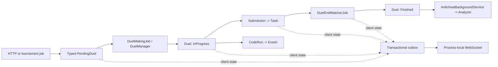

# CoDuels Backend processes

This directory documents the behavior observed at `CoDuels-Backend` revision
`b0ca65fb91bc`. Source code, EF mappings, runtime configuration, and assertions
in `Duely/tests` are the evidence. The documents intentionally distinguish
current behavior from proposed requirements; an implementation detail is not
automatically treated as an approved product rule.

## Duely business processes

## Process map

| Process | Document | Main owner |
| --- | --- | --- |
| Rating search and automatic pairing | [Ranked matchmaking](ranked-matchmaking.md) | `StartDuelSearchHandler`, `DuelManager`, `DuelMakingJob` |
| Direct user-to-user invitations | [Friendly duel invitations](friendly-duel-invitations.md) | Friendly invitation handlers |
| Group-created invitations | [Group duels](group-duels.md) | Group duel invitation handlers |
| Tournament scheduling and invitations | [Tournament duels](tournament-duels.md) | Tournament strategies and synchronization job |
| Pair conversion, live duel, and finish | [Duel lifecycle](duel-lifecycle.md) | `TryCreateDuelHandler`, `CheckDuelsForFinishHandler` |
| WebSocket ticket, replacement, and disconnect cleanup | [User connection lifecycle](user-connection-lifecycle.md) | HTTP WebSocket services, `CancelPendingDuelsHandler` |
| Submission and custom-run execution | [Submission and testing](submission-and-testing.md) | Submission/code-run handlers, Taski/Exesh adapters |
| Durable side effects and client notifications | [Notifications and outbox](notifications-and-outbox.md) | Outbox handlers and `OutboxJob` |
| Action capture and suspicion scoring | [Post-duel anti-cheat](post-duel-anticheat.md) | Finish handler and anti-cheat background service |

Supporting material:

- [Glossary](glossary.md) defines duel, pending, connection, message, and status terms.
- [Open questions](open-questions.md) consolidates ambiguous behavior, likely defects, races, and test gaps.

## End-to-end overview

The diagram shows ownership, not a single transaction. Duel creation uses two
`SaveChangesAsync` calls inside one explicit pair transaction. Calling Taski,
Exesh, Analyzer, or a WebSocket is never atomic with PostgreSQL.

## Cross-process cleanup matrix

This matrix describes the successful paths in the current implementation.
It does not imply that concurrent requests are serialized.

| Trigger | Ranked | Outgoing Friendly | Incoming Friendly | Group | Tournament |
| --- | --- | --- | --- | --- | --- |
| Start ranked search | Preserve existing or create one | Delete one; notify both sides | Unchanged | Unchanged | Unchanged |
| Create Friendly invitation | Delete actor's one Ranked | Preserve if same opponent; otherwise replace and notify both sides | Unchanged | Unchanged | Unchanged |
| Accept Friendly/Group/Tournament invitation | Delete acceptor's one Ranked | Delete acceptor's one; notify only the acceptor | Target invitation is accepted | Only the target acceptance changes | Only the target acceptance changes |
| `POST /duels/cancel` or WebSocket cleanup | Delete all for user | Delete all; notify both sides | Keep rows, reset invitee acceptance | Keep rows, reset this user's acceptance | Keep rows, reset this user's acceptance |
| Convert a selected pair to `Duel` | Delete only `UsedPendingDuels` | Other rows remain | Other rows remain | Other rows remain | Other rows remain |

Two qualifications matter:

1. If a ranked row already exists, `StartDuelSearchHandler` returns before
   saving staged Friendly cleanup. In that combined state, the documented
   cancellation does not reach the database.
2. `TryCreateDuelHandler` does not remove other pending rows for the selected
   users, but it locks both users and skips a pair when either already has an
   active duel.

## Transaction vocabulary

- One EF `SaveChangesAsync` is treated as one database transaction when no
  explicit transaction surrounds it.
- An explicit EF transaction can contain multiple saves; only a successful
  commit makes all of them durable together.
- A business row and an `OutboxMessage` created in the same save or explicit
  transaction are atomically recorded. Delivery is later and is not exactly
  once.
- A handler that changes tracked entities and returns before saving has not
  changed durable business state.
- External calls made by an outbox handler can succeed before deletion of the
  outbox row commits. Retrying can therefore repeat the external side effect.

## Evidence and test limitations

Focused handler and domain tests are linked from each process. Most application
tests derive from `ContextBasedTest` and use EF's in-memory provider. They prove
the asserted handler outcome but do not prove PostgreSQL constraints, row-lock
behavior, transaction isolation, or cross-instance races. There are no tests of
the WebSocket handler/connection manager or of `OutboxJob` claiming and retrying
rows.

One naming discrepancy is already present: tests named
`Get_incoming_ranked_invitations_*` exercise `FriendlyPendingDuel`, not Ranked
matchmaking. The assertions and production types are used as evidence.

## Maintenance rule

When behavior changes, update the owning process and all linked processes that
consume its messages or cleanup. In particular, review the cleanup matrix and
[notification registry](notifications-and-outbox.md#message-registry) whenever
a pending transition or recipient changes.

## Other component process documentation

- [Exesh distributed execution processes](exesh/README.md)
- [Taski task and testing processes](taski/README.md)
