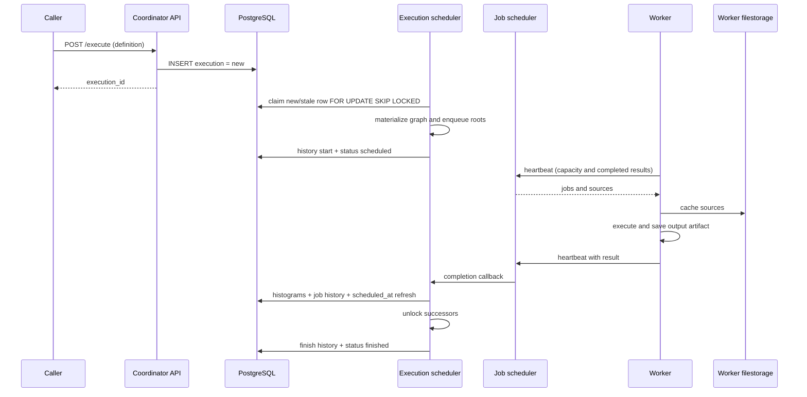
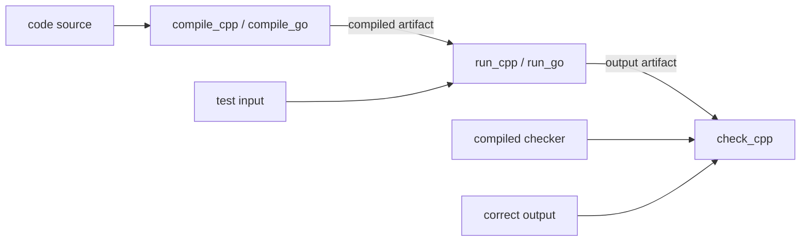

# Exesh distributed execution processes

This directory documents behavior observed at `CoDuels-Backend` revision
`b0ca65fb91bc` and filestorage revision `f637043ca6a7`. Code, runtime wiring,
PostgreSQL queries, Ansible configuration, and committed tests are the source of
truth. The documents separate observed behavior from proposed requirements.

## Process map

| Process | Document | Main owner |
| --- | --- | --- |
| Accept and persist an execution definition | [Execution submission](execution-submission.md) | coordinator API and execute use case |
| Materialize definitions, dependencies, and chains | [Execution graph](execution-graph.md) | execution factory and graph |
| Claim, retry, and finish executions | [Execution scheduling](execution-scheduling.md) | execution scheduler |
| Estimate weight and rank ready executions | [Execution priority](execution-priority.md) | calculator and scheduler execution wrapper |
| Place jobs with reservations | [Job scheduling and promises](job-scheduling-and-promises.md) | job scheduler |
| Register and expire workers | [Worker lifecycle](worker-lifecycle.md) | worker and worker pool |
| Exchange results, work, and sources | [Heartbeat and job dispatch](heartbeat-and-job-dispatch.md) | heartbeat API/use case/client |
| Prepare and execute one job or chain | [Worker job execution](worker-job-execution.md) | worker, executors, runtimes |
| Cache inputs and move outputs between workers | [Sources and artifacts](sources-and-artifacts.md) | providers and filestorage |
| Apply results and close an execution | [Results and completion](results-and-completion.md) | both schedulers and dispatcher |
| Persist history and optionally publish Kafka | [Messages, history, and outbox](messages-history-and-outbox.md) | dispatcher and PostgreSQL storages |
| Describe restart and dependency failures | [Failure and recovery](failure-and-recovery.md) | all runtime participants |
| Locate every durable and process-local state | [State ownership and persistence](state-ownership-and-persistence.md) | coordinator, worker, PostgreSQL, filestorage |

Supporting material:

- [Open questions](open-questions.md) consolidates ambiguities, likely defects,
  safety risks, and missing decisions.
- [Glossary](glossary.md) defines execution, stage, job, promise, source,
  artifact, history, outbox, and retry terminology.

## End-to-end overview

The response to `POST /execute` means only that the definition was persisted.
There is no durable job ledger. The graph, queues, promises, worker registry,
started jobs, and artifact locations are reconstructed only by replaying the
whole definition, not by resuming individual job progress.

## Compile, run, and check DAG

Within a stage, the current reducer can collapse a single-successor path into
one `chain` job. A chain shares one runtime selected from its first inner job;
this materially changes isolation and artifact transfer and is described in
[Worker job execution](worker-job-execution.md).

## Runtime configuration snapshot

The checked-in coordinator polls every `500ms`, has capacity
`7,680,000,000`, retries a stale scheduled execution after `30s`, keeps at most
five promised jobs, reschedules promises every `100ms`, and removes a worker
after `1s` without heartbeat. Workers heartbeat every `100ms`, poll their local
queue every `10ms`, default to two slots and `1024MB`, cache sources for `15m`,
and keep output artifacts for `5m`. Production Ansible currently starts one
coordinator and two four-slot, `2048MB` workers and disables Kafka, so consumers
poll message history over REST.

## Most important boundaries

- `Executions`, `Messages`, `Outbox`, category histograms, and scheduler event
  tables are PostgreSQL-backed. Scheduler events are asynchronous telemetry,
  not part of business transactions.
- Coordinator and worker filestorage roots are local filesystem state. The
  production playbook does not mount durable volumes for those roots.
- Execution retry is whole-definition replay. It is not a persisted job retry
  and does not prove that an earlier worker stopped.
- Worker removal only deletes its process-local registry record. It does not
  requeue or fail its `startedJobs` and does not replicate its artifacts.
- Message history, outbox rows, and Kafka records are three distinct concepts.
  History is always written; outbox/Kafka are used only when Kafka is enabled.

## Evidence and test limitations

No `*_test.go` files are committed in the Exesh module at this revision.
Filestorage has its own tests for reserve/download/TTL behavior, but those do
not test Exesh orchestration, PostgreSQL transaction composition, duplicate
heartbeats, coordinator restart, worker death, or end-to-end isolation.

## Maintenance rule

Read the owning process before changing scheduler, heartbeat, worker,
artifact, message, or persistence behavior. Re-check both the durable and
process-local state inventories and update every affected consumer contract.

