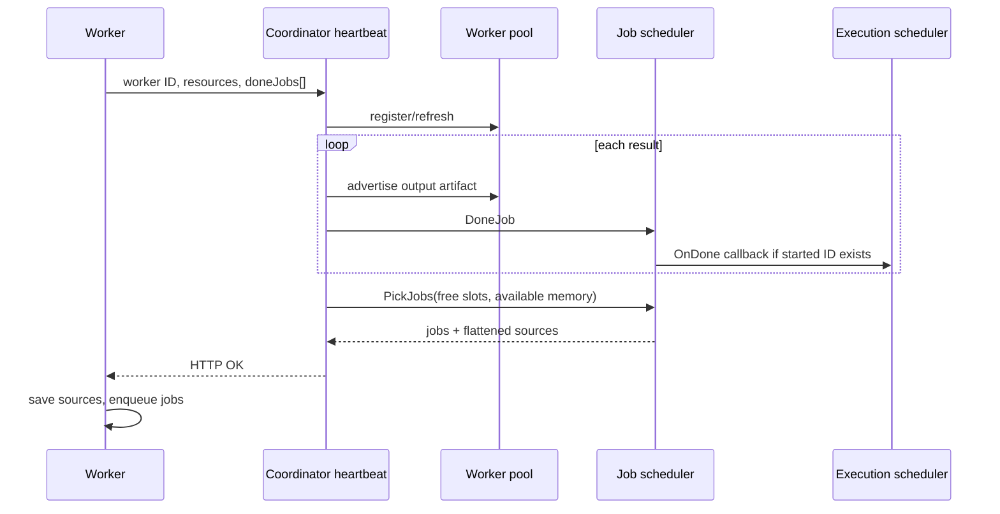

# Heartbeat and job dispatch

## Purpose

Use one bidirectional HTTP exchange to refresh worker liveness, acknowledge a
batch of completed results, advertise artifacts, and pull the next jobs and
their source descriptors.

## Participants

Worker heartbeat loop/client, coordinator `/heartbeat` handler and use case,
worker pool, job scheduler, execution scheduler callbacks, source/artifact
registry, JSON result/job/source types, and HTTP network.

## Trigger

The worker's 100ms ticker sends a request. The loop is sequential: it does not
start another heartbeat until the prior call returns.

## Preconditions

Worker ID and coordinator endpoint must be configured. Completed results must
serialize, and output-bearing results are assumed to carry non-null artifact
trash timestamps. Coordinator and any source worker HTTP endpoints must be
reachable by the receiving worker.

## Current behavior

1. Under its mutex, the worker copies and clears `doneJobs`, then reports
   configured totals and free/available values after subtracting running and
   queued predicted memory/slots.
2. The client creates a new default `http.Client` with no client timeout; the
   root context is its only bound. Non-200, invalid JSON, or non-OK response is
   an error.
3. On error, the worker appends the sent results back to the end of `doneJobs`.
   Concurrently completed jobs may already precede them, so result order can
   change.
4. The handler decodes JSON. A decode error renders an ERROR response without
   setting an HTTP status, so it normally remains HTTP 200; the client then sees
   the application error.
5. The use case normalizes totals as `max(total, free/available)`, registers or
   refreshes the worker, and processes reported results in request order.
6. For every output-bearing normal result, and every output-bearing inner chain
   result, it dereferences `artifact_trash_time` and calls `PutArtifact` before
   `DoneJob`. There is no validation or per-result error response.
7. `DoneJob` accepts only IDs found in the process-local `startedJobs`; unknown
   or duplicate results are silently ignored. A recognized result is removed
   before its execution callback performs database work.
8. After the entire batch, the job scheduler returns up to reported free slots
   of jobs plus a flattened list of source descriptors. The response does not
   map each source to a job explicitly; jobs refer to source IDs.
9. On an OK response, the worker considers all sent results acknowledged. It
   attempts to save every returned source; errors are logged but do not prevent
   enqueueing every returned job.

There is no request sequence, worker session, result acknowledgement list,
dispatch token, response replay cache, body limit, or partial-success protocol.

## State transitions

Worker: `completed result pending -> in-flight heartbeat -> acknowledged` on any
OK response; on client error it returns to pending. Coordinator:
`worker unknown -> registered`, `started job -> completed/removed`; job:
`selected -> response in flight -> queued on worker` is conceptual and has no
acknowledged intermediate state.

## State ownership

| State | Owner | Stored in | Survives restart | Source of truth |
| --- | --- | --- | --- | --- |
| Pending completed results | worker | `doneJobs` heap slice | No | Worker slice |
| Reported capacity | worker | Request only | No | Current worker counters |
| Registered capacity/liveness | worker pool | Coordinator heap | No | Pool entry |
| Started-job recognition | job scheduler | Coordinator heap | No | `startedJobs` |
| Artifact locations/expiry | worker pool | Coordinator heap | No | Artifact map |
| Returned jobs/sources | HTTP response | In flight then worker heap/cache | No | Neither after loss |
| Applied history/status | dispatcher/execution storage | PostgreSQL | Yes | Durable rows |

## Persistence and transaction boundaries

The heartbeat itself is not wrapped in one transaction. Each recognized result
callback may open its own PostgreSQL transaction and can perform significant
work before the handler moves to the next result. Worker registration, artifact
advertisement, started removal, and dispatch are process-local and are not
rolled back if a later result panics/fails. The use case returns no error, so the
handler cannot express partial application.

## Idempotency and duplicate handling

Repeated empty heartbeats refresh liveness safely. A repeated completed result
is ignored after the first removal from `startedJobs` while that coordinator
process lives. If the first callback removed it but then failed database work,
the repeat is still ignored. After coordinator restart, all old results are
unknown. Duplicate jobs in responses are not deduplicated by workers and can run
again. Repeated source saving is partly idempotent through filestorage but has
an in-memory registration caveat described in [Sources and artifacts](sources-and-artifacts.md).

## Concurrency and races

Different workers and even manually concurrent requests for the same ID can be
handled concurrently. Pool/job mutexes protect individual structures, not the
whole batch. Worker removal can race between registration and `PutArtifact`.
Concurrent results for the same job race to remove one started entry; only one
gets a callback, but worker identity is not checked against the stored owner.
Callbacks for different jobs can race on execution progress and terminal state.

## Failure handling

Network/HTTP/decode/application error requeues the whole result batch locally.
An OK response acknowledges everything even if some results were unknown. A
nil artifact timestamp is dereferenced and can panic the coordinator. Source
save failures on the worker lead to later executor input errors, not dispatch
rejection. Loss of the response after coordinator processing yields result
redelivery but can also lose newly assigned jobs because the coordinator has
already marked them started.

## Emitted messages/events

| Output | Condition | Durable | Notes |
| --- | --- | --- | --- |
| Worker `heartbeat` event | Request registers/refreshes | Best effort | Uses coordinator predictions |
| Job `finished` event | Recognized result | Best effort | Before completion callback |
| Job business messages | Callback succeeds | Yes on transaction commit | One per normal/inner result |
| HTTP jobs/sources | Work available | No | No dispatch acknowledgement |
| Logs | Batch has completions/errors | Log dependent | No per-result ack outcome |

## Observability

Coordinator logs batches with completed count and reported free resources.
Worker logs heartbeat and source-save errors. Scheduler tables provide
heartbeat/job-finish events but no request ID, round-trip duration, payload
size, unknown-result count, duplicate count, acknowledgement status, or jobs
lost with a response.

## Implementation references

- `Exesh/internal/worker/worker.go`
- `Exesh/internal/api/heartbeat/{api.go,client.go,handler.go}`
- `Exesh/internal/usecase/heartbeat/usecase.go`
- `Exesh/internal/scheduler/{job_scheduler.go,worker_pool.go}`

## Current guarantees

The worker preserves a result batch when its client observes an error. In one
live coordinator, only the first result found for a started job invokes its
callback. A successful handler response contains jobs and source IDs that were
selected after processing the request's result order. It does not guarantee
durable acknowledgement or delivery of assigned jobs.

## Open questions

Does OK mean every result was durably applied? How should partial batches be
acknowledged? Should dispatch use push, pull, or a lease/ack pair? How are late
results tied to worker sessions and attempts? See [Open questions](open-questions.md).

## Proposed requirements

- Add worker session, heartbeat sequence, per-result acknowledgement, and job
  dispatch attempt tokens.
- Validate all result fields before mutating pool/scheduler state.
- Add bounded HTTP timeouts/body sizes and explicit 400 on decode errors.
- Do not enqueue a job until all its sources are saved, or return an explicit
  source/dispatch failure.
- Make response loss replay-safe for both results and assignments.

## Test coverage

- **Existing tests / covered scenarios:** none in Exesh.
- **Missing scenarios:** JSON/errors, retry/reordering, partial batches,
  duplicate/unknown results, source failure, and same-ID concurrency.
- **Required integration tests:** worker/coordinator HTTP exchange with multiple
  results, jobs, sources, acknowledgements, and restart.
- **Required failure-injection tests:** drop request/response, return malformed
  payloads, inject nil trash time, delay handler, and fail source download.

## Heartbeat sequence

