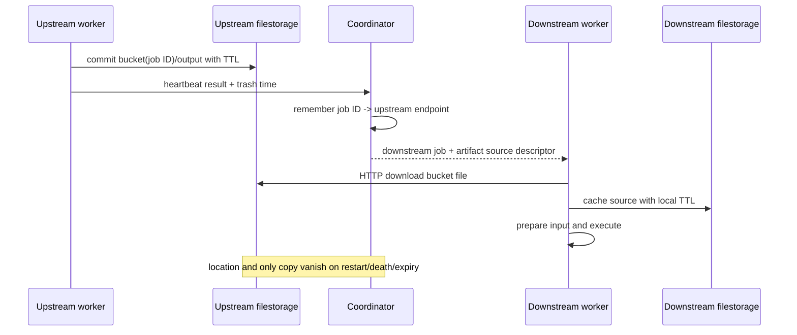

# Sources and artifacts

## Purpose

Make submitted inputs available to workers, persist job outputs temporarily,
and route an upstream worker's artifact to a downstream worker.

## Participants

Caller filestorage, execution factory, coordinator filestorage and HTTP routes,
worker pool artifact registry, heartbeat response, worker source/output
providers, worker filestorage/HTTP routes, executors, and filestorage trasher.

## Trigger

Execution materialization downloads external sources; job dispatch resolves
source descriptors; a worker heartbeat response caches them; output-bearing
execution reserves an artifact; downstream source resolution looks up the
producing worker.

## Preconditions

Source names/types and file paths must resolve. Coordinator/worker HTTP
filestorage endpoints must be mutually reachable. An artifact-producing result
must reach the coordinator before any dependent job is picked, and its worker
must still be registered with more than one minute remaining before trash time.

## Current behavior

1. Inline definitions remain content in the durable execution JSON. External
   bucket/file definitions include a bucket ID and caller-provided download
   endpoint.
2. At materialization, the coordinator downloads external data into its local
   filestorage. Full bucket definitions use a 30-minute TTL. `DownloadBucket`
   extends an existing bucket's TTL; file download creates the bucket if absent.
3. Job inputs become source descriptors. Inline content is sent directly.
   Coordinator-cached file descriptors point back to the coordinator's HTTP
   endpoint. Artifact inputs use source ID equal to producing job ID.
4. A worker saves inline content to a bucket/file derived from source ID or
   downloads a file from its descriptor endpoint with a 15-minute local TTL.
   `SourceProvider` separately records source ID -> bucket/file in a heap map.
5. Executors locate inputs through that map; filestorage extends the bucket TTL
   and holds read locks until copy completes.
6. Output reservation uses bucket ID equal to job ID and configured filename
   (`bin` or `output`) with a five-minute TTL. Commit records filestorage's
   trash timestamp in the result.
7. On heartbeat, the coordinator records `jobID -> trashTime` under the
   reporting worker. Chain inner results advertise only outputs still marked
   `HasOutput`; non-last inner outputs are deliberately set false and stay only
   inside the shared runtime.
8. A dependent job resolves its producer through all live worker artifact maps.
   Entries with less than one minute before expiry are removed; one remaining
   worker is chosen randomly. The descriptor uses the selected worker ID as its
   HTTP endpoint, bucket=producer job ID, and the producing job's configured
   output filename.
9. The downstream worker downloads the file and executes. There is no
   coordinator copy, durable location record, checksum verification in Exesh,
   replication, or renewal initiated by the coordinator.

Filestorage TTL is an expiry target, not exact deletion: collector and worker
ticks remove expired unlocked buckets later. Production worker/coordinator
containers have no explicit persistent filestorage volumes.

## State transitions

Source: `definition -> coordinator descriptor/cache -> worker cache -> expired`.
Artifact: `runtime output -> reserved -> committed -> advertised -> downloaded
by downstream -> expired`. Advertisement and download are not persisted states.

## State ownership

| State | Owner | Stored in | Survives restart | Source of truth |
| --- | --- | --- | --- | --- |
| Source definitions/content/endpoints | caller/definition | `Executions.sources` JSONB | Yes | PostgreSQL |
| Coordinator cached external source | coordinator filestorage | Local files/meta | Not in production container restart | Local bucket |
| Materialized source descriptors | execution object | Coordinator heap | No | Source maps |
| Worker source-ID mapping | source provider | Worker heap | No | Map, despite files |
| Worker cached source bytes | worker filestorage | Local files/meta | Deployment-dependent | Local bucket |
| Output artifact bytes/expiry | output provider/filestorage | Worker local files/meta | Deployment-dependent | Worker bucket |
| Artifact locations | worker pool | Coordinator heap | No | Live worker maps |

## Persistence and transaction boundaries

Definitions are PostgreSQL durable. Source download may occur inside an
execution claim transaction, but filesystem state is outside rollback. Worker
reserve/commit is filesystem-local. Artifact advertisement occurs before result
completion persistence in heartbeat processing and is not rolled back if the
result callback fails. No persisted data can recover which worker owns an
artifact after coordinator restart.

## Idempotency and duplicate handling

Deterministic IDs and filestorage existing-file behavior make repeated downloads
and output saves partially reusable. For inline sources, if the file already
exists, `SaveSource` returns before re-adding the source to the provider map;
after a worker-process restart with surviving files, the source can therefore
still be unlocatable. Repeated artifact output can reuse a previous attempt's
file. Repeated advertisements overwrite expiry for the same worker/job.

## Concurrency and races

Filestorage bucket/file locks serialize reservation and protect reads from
trasher deletion. Duplicate jobs can race to the same output bucket. Worker
removal can race with artifact advertisement or lookup. Artifact selection
checks worker registry only at descriptor creation; the producer may die or the
file may expire before downstream download. There is no reservation pin held
across the network transfer.

## Failure handling

Materialization download failure rolls back PostgreSQL scheduling but can leave
prior files/map entries. Worker source-save failure is logged and its job is
still queued, later producing an input-preparation error. Missing/near-expiry
artifact causes source resolution to synthesize a job error and finish the
execution. Output copy/commit errors are logged by the worker while the result
may still claim output, causing nil expiry panic or a descriptor to missing
data. Loss of a producer worker permanently loses its only advertised copy.

## Emitted messages/events

| Output | Condition | Durable | Notes |
| --- | --- | --- | --- |
| Filestorage HTTP download | External/cross-worker source | Files only | No business event |
| Artifact advertisement | Output result heartbeat | Coordinator heap only | Before completion callback |
| Finish error message | Source lookup becomes result error | Yes if finish commits | No artifact-specific type |
| Logs | Download/save/locate errors | Log dependent | Endpoints may appear in context |

## Observability

There are no metrics/events for source cache size, TTL extension, artifact
inventory, replication, download latency/failure, bytes, or expiry. Job failure
logs can identify source/job IDs. Filestorage has internal logs but Exesh history
does not distinguish artifact loss from other internal errors.

## Implementation references

- `Exesh/internal/factory/execution_factory.go`
- `Exesh/internal/scheduler/execution_scheduler.go` (`Sources` callback)
- `Exesh/internal/provider/{source_provider.go,output_provider.go}`
- `Exesh/internal/provider/adapter/filestorage_adapter.go`
- `Exesh/internal/usecase/heartbeat/usecase.go`
- `Exesh/internal/scheduler/worker_pool.go`
- `filestorage/internal/storage/storage.go` and `internal/trasher/trasher.go`

## Current guarantees

While a filestorage read lock is held, its trasher cannot remove that bucket;
successful locate extends TTL. A committed output has a deterministic bucket ID
and configured file name. The coordinator refuses locations within one minute
of recorded expiry. There is no guarantee of a surviving copy or recoverable
location across process/container failure.

## Open questions

Who owns artifact durability through downstream completion? Is one replica
acceptable? Should stale replay reuse prior artifacts? Are source endpoints
trusted/allow-listed? What should happen on output commit uncertainty? See
[Open questions](open-questions.md).

## Proposed requirements

- Persist artifact attempt/location/checksum metadata or centralize durable
  artifacts; define replication and retention until dependents acknowledge.
- Couple `HasOutput` to a successful commit with a non-null expiry.
- Make worker source registration idempotent even when files already exist.
- Pin/renew an artifact during dispatch and download.
- Validate endpoints and file paths at submission.

## Test coverage

- **Existing tests / covered scenarios:** no Exesh tests; filestorage tests cover
  its own locks, reserve/download, and eventual TTL deletion.
- **Missing scenarios:** source construction/cache registration, artifact
  save/lookup/expiry, duplicate output, worker loss, and cross-worker download.
- **Required integration tests:** coordinator plus two worker filestores through
  upstream output, downstream download, TTL extension, and cleanup.
- **Required failure-injection tests:** producer death, expiry during transfer,
  output commit uncertainty, duplicate producer, and coordinator restart.

## Artifact dependency flow

