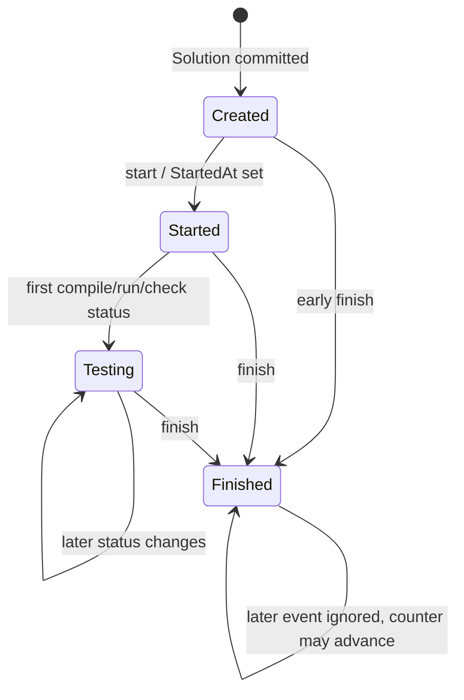

# Execution event processing

## Purpose

Apply one Exesh event to a persisted Solution/strategy and atomically record any
resulting public Taski message.

## Participants

Kafka or REST event source, event handler, update use case, Solution storage,
strategy, message dispatcher, Taski Messages/Outbox tables, and PostgreSQL UoW.

## Trigger

An Exesh `start`, `compile`, `run`, `check`, or `finish` event received through
the selected consumer mode.

## Preconditions

Event JSON/type is recognized and normally names a committed Solution by
`ExecutionID`. REST events also carry a positive per-execution Message ID.

## Current behavior

One UoW selects a Solution by execution ID `FOR UPDATE`. Missing execution IDs
return success without storage/message changes. In REST mode, Message ID less
than or equal to `HandledEventsCount` is ignored. Otherwise:

- `start` sets `StartedAt` if absent but emits `start` every time it is handled;
- compile/run/check delegates the job name/status to the strategy, then emits a
  `status` only when it differs from `LastTestingStatus`;
- `finish` sets `FinishedAt`, maps an Exesh error to a finish error, otherwise
  uses strategy verdict/message (nil verdict becomes `Testing Failed`);
- events after `FinishedAt` produce no message;
- unknown job names are ignored by strategies, although an initial computed
  status can still be emitted.

For every non-early-return event, including ignored-after-finish and unknown
jobs, `HandledEventsCount` increments by one. Strategy JSON and Solution fields
are updated. If a public message exists, its history and optional outbox row are
created through the same transaction. Any error rolls all Taski changes back.

**Current guarantees.** A successfully committed event atomically updates the
selected Solution, its strategy/counter, and its Taski history/outbox message.
This is not atomic with Kafka offset commit or Exesh history and does not make
the event exactly once.

## State transitions

`Created`, `Started`, `Testing`, and `Finished` are documentation labels; the
row stores timestamps, last status, strategy, and count rather than an enum.

## State ownership

| State | Owner | Storage | Survives restart | Source of truth |
| --- | --- | --- | --- | --- |
| Exesh event/history | Exesh/Kafka | Exesh DB or broker | Mode-dependent | Exesh/broker |
| Timestamps/cursor/last status | Taski | `Solutions` | Yes | Taski PostgreSQL |
| Job outcomes/verdict | Taski strategy | JSONB | Yes | Solution strategy |
| Public message | Taski | `Messages` (+ optional `Outbox`) | Yes | Taski PostgreSQL |

## Persistence and transaction boundaries

Solution row lock, mutation, strategy serialization, cursor increment, history,
and outbox are in one PostgreSQL transaction. Kafka offset commit occurs after
it; REST fetch is external before it. Exesh state is never rolled back. An
outbox send later has another transaction.

## Idempotency and duplicate handling

REST dedupe uses Message ID against a count. Kafka passes no Message ID, so
redelivery is reprocessed: duplicate starts emit duplicate Taski messages;
unchanged statuses are suppressed; job state usually converges; post-finish
duplicates still increment count. Missing executions are acknowledged by both
consumers' surrounding logic and are not retained.

## Ordering assumptions

Correct lifecycle assumes start, dependency-ordered job events, then finish.
No buffer/reorder exists. REST assumes contiguous event IDs starting at one;
Kafka assumes broker delivery is sufficiently ordered although the key is the
Exesh outbox ID rather than the execution ID.

## Concurrency and race conditions

`FOR UPDATE` serializes updates to one selected Solution row. Duplicate
execution IDs make selection nondeterministic. Events can acquire the lock in a
different order from creation/production, and Kafka can arrive before the row
exists. Separate Solutions process concurrently.

## Failure handling

Unknown event type/deserialization, storage, strategy serialization, message,
or commit error returns failure and rolls back. Kafka then does not commit and
can poison-block its partition; REST logs per-Solution failure and retries next
tick. Finish without prior evidence creates a terminal technical failure. A
missing finish leaves the row in progress indefinitely.

## Emitted messages

| Condition | Message type | Recipient/channel | Payload | Persistence | Retry |
| --- | --- | --- | --- | --- | --- |
| Any handled start | `start` | ExternalSolutionID / Taski history (+ Kafka if enabled) | `solution_id`, `type` | Atomic history/outbox | Event retry can duplicate |
| Changed intermediate status | `status` | same | status text | same | Suppressed if equal to last |
| First handled finish | `finish` | same | verdict or error; optional message | same | Source-mode dependent |
| After finish/duplicate REST ID | None | — | — | Counter may still update after finish | — |

## Observability

Errors are logged; Solution JSON/timestamps/counter and Taski history can be
queried. There are no metrics for event lag, duplicate/early/unknown events,
rollback, cursor gaps, row-lock wait, stuck Solutions, or finish-before-start.

## Implementation references

- `Taski/internal/handler/event_handler.go`
- `Taski/internal/usecase/testing/usecase/update/usecase.go`
- `Taski/internal/storage/postgres/{solution,message}_storage.go`
- `Taski/internal/domain/testing/event/events/*.go`
- `Taski/internal/domain/testing/strategy/strategies/*.go`

## Test coverage

- **Existing unit/integration tests:** none.
- **Covered scenarios:** none are automated.
- **Missing scenarios:** all event types, exact transitions, first failure,
  duplicate/out-of-order/missing/early/unknown/post-finish events, rollback,
  row locking, and message suppression.
- **Required contract tests:** Exesh event JSON/job/status to strategy/message
  mapping and REST Message ID semantics.
- **Required failure-injection tests:** event-before-row, concurrent/reordered
  events, DB/message/serialization/commit failure, consumer restart, poison
  event, duplicate execution IDs, and missing finish.

## Open questions

Intended event order/dedupe, unknown-execution/job handling, terminal timeout,
and whether ignored events should advance the cursor are unspecified.

## Proposed requirements

Persist an event identity/last observed ID, validate monotonic order, define
buffer/quarantine/reconciliation behavior, make execution linkage unique,
observe lag/anomalies, and cover all transition/failure scenarios.

