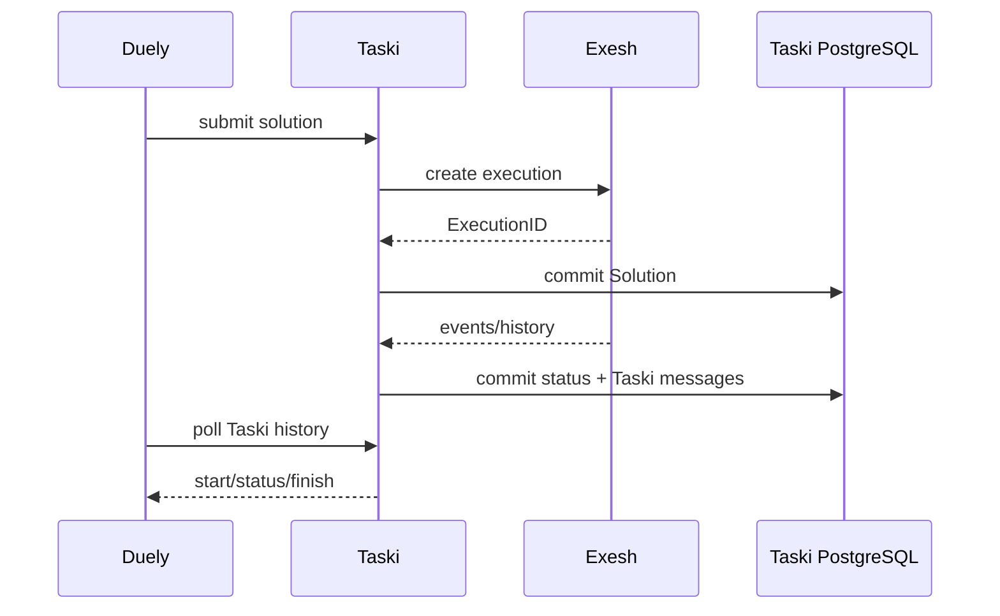

# Failure and recovery

## Purpose

Describe Taski's actual restart/retry behavior and enumerate duplicate, lost,
orphan, stuck, and incompatible states across the full testing pipeline.

## Participants

Uploader/filestorage, Taski API/PostgreSQL, Exesh, Kafka, REST pollers,
dispatcher/outbox, Duely, deployment/runtime, and operators.

## Trigger

Process death, network/database/storage/broker failure, malformed data,
duplicate/out-of-order event, timeout, worker/artifact loss, or restart.

## Preconditions

At least one process is in flight or durable state exists to resume. Automatic
recovery requires the relevant history/bucket/row to remain available and
compatible with the restarted binary.

## Current behavior

Uploader aborts reserved buckets on returned errors, but process death and host
subprocess effects are outside transactional recovery. Submission rollback does
not undo an already accepted Exesh execution. Kafka redelivers after Taski DB
success/offset failure but loses early unknown-execution events by committing
them. Production REST polling reloads unfinished rows and resumes from persisted
count against retained Exesh history. Missing finish never terminalizes.

Event UoW rollback keeps Solution/message/cursor consistent locally. Strategy
JSON incompatibility makes a row repeatedly fail. History/outbox create is
atomic, but Kafka publish/delete is not; duplicates are possible. Failed outbox
retry metadata does not persist and its due check is inverted. Duely production
resumes its separate Taski history cursor, but relies on contiguous message IDs.

**Current guarantees.** Committed local transactions survive restart, and
production REST histories allow replay after temporary Taski/Duely process
failure while all rows/history remain compatible and intact. There is no
automatic global reconciliation, exactly-once delivery, or bounded completion.



```mermaid
sequenceDiagram
    participant T as Taski
    participant E as Exesh
    participant P as Taski PostgreSQL
    T->>E: create execution
    E-->>T: ExecutionID accepted
    T->>P: INSERT Solution
    P--xT: rollback/commit failure
    Note over E,P: Exesh execution exists; Taski has no link
```

Additional mandatory early-event, repeated-Kafka, restart-polling, and outbox-
duplicate diagrams are in [Kafka consumption](kafka-event-consumption.md),
[REST polling](rest-event-polling.md), and [message outbox](message-history-and-outbox.md).

| Failure | Durable state after failure | Automatic behavior | Duplicate/orphan/stuck risk |
| --- | --- | --- | --- |
| Uploader error before commit | No committed task; temporary bucket normally aborted | None | Crash can leave temporary data; host effect remains |
| Exesh rejects graph | No Solution | Caller sees error | No accepted execution expected |
| Exesh accepts; Taski rollback | Exesh execution only | None | Orphan execution |
| HTTP response lost after both commits | Execution + Solution | Polling continues | Caller retry duplicates both |
| Kafka event before Solution | Broker offset committed, no Taski change | None | Lost start/job/finish |
| Kafka DB commit then offset failure | Taski change committed | Redelivery | Duplicate start/counter/message |
| REST/Taski restart | Solution count + Exesh history remain | Resume at count+1 | Safe only with contiguous IDs |
| Finish event missing | unfinished Solution | Poll forever | Permanently stuck |
| Strategy JSON incompatible | unreadable unfinished row | Retry/log each tick | Stuck, blocks that Solution |
| Taski history read fails in Duely | Taski message remains | Duely next poll retries | Delayed, not lost while retained |
| Kafka publish succeeds; outbox delete fails | Outbox row remains + broker record exists | Publish again | Duplicate delivery |
| Oldest outbox poison | row remains | Retry/skip behavior is defective | Later outbox starvation |
| Corrupt task bucket | durable corrupt bucket | reads/list/metrics fail | Catalog degradation |

## State transitions

Recovery transitions are `in-flight -> rollback to last local commit -> retry
from durable cursor` where implemented. Submission orphan and early Kafka loss
have no recovery transition. Missing finish/incompatible strategy remain
indefinitely nonterminal.

## State ownership

| State | Owner | Storage | Survives restart | Source of truth |
| --- | --- | --- | --- | --- |
| Last Taski event commit/cursor | Taski | PostgreSQL | Yes | Taski |
| Replayable raw events | Exesh | history DB | Yes currently | Exesh |
| Kafka retry/offset | Kafka | broker | Yes | consumer group |
| Taski public replay | Taski | Messages | Yes | Taski |
| Duely last public-message count | Duely | PostgreSQL | Yes | Duely |
| Orphan linkage knowledge | Nobody | Not persisted | No | Manual cross-query only |

## Persistence and transaction boundaries

Every cross-service arrow is a failure window. Local Taski event atomically
commits Solution+message+outbox, but submission external call precedes local
commit, Kafka offset follows it, outbox publish precedes delete, and Duely
applies history in another database. Bucket publication is separate again.

## Idempotency and duplicate handling

Task upload rejects duplicate IDs but is not an update. Submission is not
idempotent. Kafka event processing lacks durable dedupe. REST counts dedupe only
contiguous IDs. Taski public history has unique numeric IDs but duplicate
semantics are possible. Outbox and Kafka consumer delivery are at least once.

## Ordering assumptions

Recovery assumes retained histories, IDs `1..N`, start/jobs/finish order,
stable job names/strategy JSON, and unchanged task buckets. Gaps, retention,
rolling incompatibility, or reordered finish are not repaired.

## Concurrency and race conditions

The critical races are Exesh event versus Solution commit, client retry versus
ambiguous response, multiple pollers/consumers versus the same row, duplicate
IDs versus row-lock lookup/allocation, worker download versus task lifetime,
and publish versus DB delete/offset commit.

## Failure handling

Most errors log and retry at the surrounding loop/request. There is no circuit
breaker, bounded retry/dead-letter for events/outbox, cancellation/reconciler
for execution, terminal timeout, corrupt-task quarantine, strategy migration,
or manual recovery API. An HTTP client without timeout can stall a loop/UoW.

## Emitted messages

| Condition | Message type | Recipient/channel | Payload | Persistence | Retry |
| --- | --- | --- | --- | --- | --- |
| Recoverable event succeeds | Taski start/status/finish | history/outbox | derived progress | Durable | Source retry until commit |
| Infrastructure finish | `finish` error/verdict | Duely | error or `Testing Failed` | Durable | History/outbox rules |
| Internal recovery failure | log | operators | context/error | Logs only | Loop/request-specific |

## Observability

Logs and database histories support manual reconstruction when correlation IDs
are known. Current metrics do not expose orphans, duplicates, retry counts,
cursor gaps/lag, stuck Solutions, corrupt tasks, strategy compatibility,
history age, outbox backlog, or lock/HTTP stall duration.

## Implementation references

- All Taski process files linked by [README](README.md)
- `Taski/cmd/taski/main.go`
- `Taski/internal/consumer/*.go`
- `Taski/internal/dispatcher/message_dispatcher.go`
- `Taski/internal/producer/message_producer.go`
- `Taski/internal/storage/postgres/*.go`
- [Exesh failure and recovery](../exesh/failure-and-recovery.md)
- `Duely/src/Duely.Infrastructure.BackgroundJobs/TaskiSubmissionStatusRestPoller.cs`

## Test coverage

- **Existing unit/integration tests:** Taski has no automated tests.
- **Covered scenarios:** none of this recovery matrix is demonstrated in Taski.
- **Missing scenarios:** every crash point, retry, duplicate, ordering, timeout,
  corruption, multi-instance, history retention, orphan/stuck, and version skew.
- **Required contract tests:** full production Duely→Taski→Exesh→Taski→Duely
  round trip with both independent REST cursors and explicit Kafka-mode suite.
- **Required failure-injection tests:** process/DB/network death before/after
  every commit/send, event before row, repeated Kafka delivery, REST restart/
  pagination, outbox duplicate/poison, worker/task artifact loss, missing finish,
  corrupt bucket/strategy, and rolling deployment.

## Open questions

Owners and SLAs for reconciliation, timeout, cancellation, dead letter,
retention, compatibility migration, operator tooling, and data repair are not
defined.

## Proposed requirements

Create explicit idempotency/inbox/outbox and reconciliation contracts; use
bounded calls/retries with dead letters; persist last IDs and version schemas;
enforce unique linkage and retention/leases; expose stuck/orphan/lag/backlog
signals; and make the failure matrix an executable integration suite.
