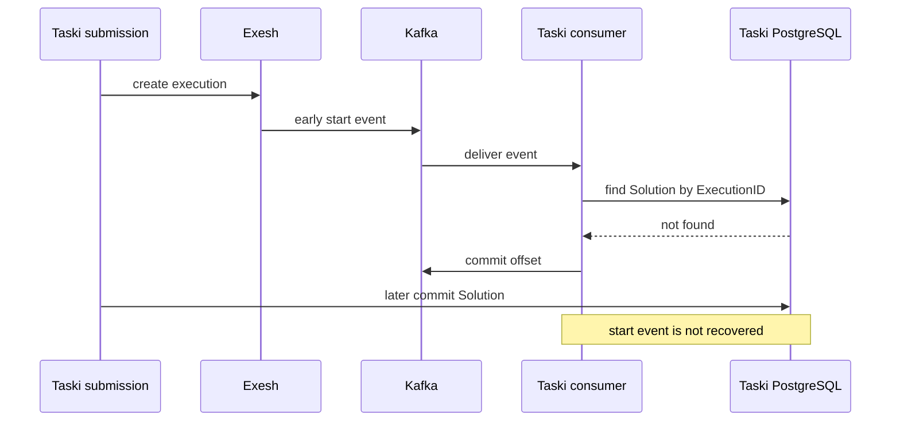
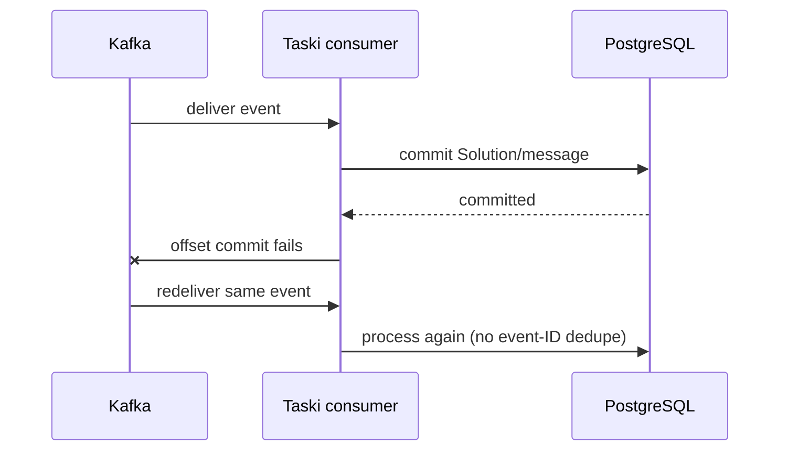

# Kafka event consumption

## Purpose

Consume Exesh execution events from Kafka and feed Taski's transactional event
update path.

## Participants

Exesh outbox/producer, Kafka, Taski Kafka reader, event handler/update use case,
PostgreSQL, and message dispatcher.

## Trigger

Kafka reader fetch loop after Taski starts in `event_consumer.mode=kafka`.

## Preconditions

Brokers/topic/group and optional SASL settings are valid; event JSON matches
Taski types; a corresponding Solution is committed.

## Current behavior

The consumer fetches one message, decodes it, calls the update path without a
Message ID, then commits the Kafka message only after the Taski transaction
succeeds. Fetch pacing uses a ticker configured by `fetch_interval`; a zero
duration can panic and tickers are not stopped. Reader close is deferred by
application wiring.

If Exesh emits before Taski saves the Solution, update treats the unknown
execution as successful and the Kafka offset is committed, permanently losing
that event for this group. JSON/update failures leave the offset uncommitted, so
the same record is retried and may block the partition.

**Current guarantees.** Database failure precedes offset commit, yielding
at-least-once delivery attempts for known valid events. There is no durable
application dedupe because the Kafka path supplies no event ID.

## State transitions

`broker record unconsumed -> fetched -> Taski transaction committed -> offset
committed`. Failures after DB commit can return to `fetched` through redelivery;
unknown execution skips directly to offset committed.

## State ownership

| State | Owner | Storage | Survives restart | Source of truth |
| --- | --- | --- | --- | --- |
| Event record/offset | Kafka | broker/group offsets | Yes | Kafka |
| Solution/job/verdict | Taski | PostgreSQL | Yes | Taski |
| Fetch ticker/current record | consumer | memory | No | process |
| Exesh event history | Exesh | Exesh PostgreSQL | Yes | Exesh, but Kafka consumer does not reconcile it |

## Persistence and transaction boundaries

Kafka publish, Taski DB commit, and Kafka offset commit are three independent
transactions. Only Solution/history/outbox mutation is locally atomic. Offset
commit failure after DB success duplicates; offset success for an unknown row
loses the event.

## Idempotency and duplicate handling

No Message ID/idempotency table is used. Job booleans and equal-status
suppression provide partial convergence, but start/public messages and counters
can duplicate. Exesh Kafka key is its outbox ID, not an explicit per-execution
ordering/dedupe key.

## Ordering assumptions

The path assumes broker partition ordering yields a useful per-execution order;
the key does not establish it. Multiple partitions/instances can present events
for one execution in different orders; row locking serializes application, not
producer chronology.

## Concurrency and race conditions

Primary race is event before Solution commit. Multiple group consumers process
partitions concurrently. Commit loss produces concurrent/repeated effects;
poison records can starve later records in a partition.

## Failure handling

Fetch/decode/update/commit errors are logged and returned to the loop; poison
data repeats without dead-letter/skip policy. Broker unavailability retries via
reader behavior. There is no fallback/reconciliation against Exesh REST
history, no early-event holding area, and no durable retry count.

## Emitted messages

| Condition | Message type | Recipient/channel | Payload | Persistence | Retry |
| --- | --- | --- | --- | --- | --- |
| Known event updates status | Taski testing message | history/outbox | start/status/finish | Atomic Taski DB | Kafka redelivery repeats update |
| Unknown execution | None | — | — | Offset committed | No recovery |
| Poison/failure | log | operators | error | logs only | Repeated record |

## Observability

Consumer logs expose start/errors. There are no Kafka lag, partition, commit
failure, duplicate, poison, unknown-execution, or early-event metrics, and no
admin endpoint for offsets/dead letters.

## Implementation references

- `Taski/internal/consumer/event_consumer.go`
- `Taski/internal/handler/event_handler.go`
- `Taski/internal/usecase/testing/usecase/update/usecase.go`
- `Taski/internal/config/config.go`
- `Taski/config/taski.yml`
- `Exesh/internal/producer/message_producer.go`

## Test coverage

- **Existing unit/integration tests:** none.
- **Covered scenarios:** none are automated.
- **Missing scenarios:** success, redelivery, early/unknown, poison, ordering,
  partition concurrency, broker/offset commit failure, restart, and shutdown.
- **Required contract tests:** Exesh-produced JSON/topic/auth/key consumed by
  Taski and exact offset/transaction sequencing.
- **Required failure-injection tests:** event before Solution save, DB commit
  failure, offset failure after commit, repeated delivery, malformed event,
  broker loss/rebalance, multiple instances, and zero interval.

## Open questions

Kafka ordering key, early/poison policy, event identity, dead letter,
reconciliation, and whether this mode remains supported are unspecified.

## Proposed requirements

Use a stable per-execution key and durable event ID/inbox; retry unknown events;
define poison/dead-letter and rebalance behavior; expose lag/failure metrics;
bound/validate intervals; and continuously contract-test Kafka mode separately
from REST mode.

