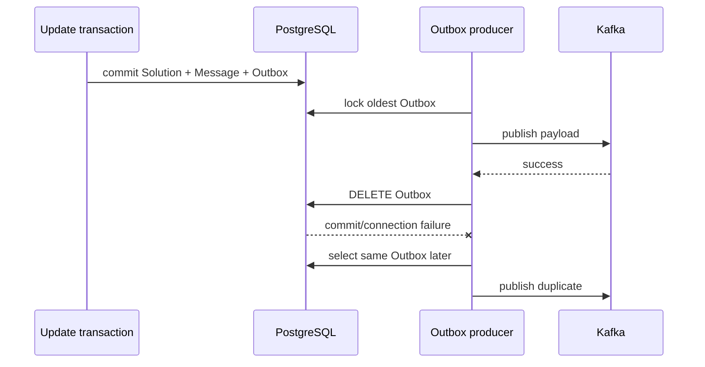

# Message history and outbox

## Purpose

Persist Taski public testing messages for REST consumers and optionally deliver
the same payloads to Kafka through a transactional outbox.

## Participants

Update use case, message dispatcher, PostgreSQL `Solutions`, `Messages`, and
`Outbox`, outbox producer loop, Kafka writer, Taski REST API, and Duely.

## Trigger

A Taski event transaction emits a public message; a Duely REST request reads
history; or the producer ticker retries the oldest outbox row.

## Preconditions

An external Solution ID maps to a Solution row. Kafka mode additionally needs
enabled dispatcher/broker/topic. Production has Kafka dispatcher disabled.

## Current behavior

Message creation locks all Solution rows with the external ID, computes
`max(message_id)+1`, and inserts history keyed by
`(solution_id,message_id)`. With Kafka enabled, the dispatcher also inserts a
serialized outbox row in the same UoW. With Kafka disabled it stores history
only. The REST API returns messages for an external ID with inclusive
`start_id`, requested count, and ascending IDs; there is no retention limit.

The outbox producer repeatedly selects the oldest row `FOR UPDATE` without
`SKIP LOCKED`, writes one Kafka message (`BatchSize=1`, `MaxAttempts=1`, key is
outbox ID), and deletes it in the UoW. Kafka success followed by delete/commit
failure redelivers. On send failure it attempts to store failure time/count,
but returns the error so that transaction rolls back. The retry due check is
inverted: a row whose `failed_at + timeout` is already before now is skipped,
whereas a not-yet-due row is attempted. A poison oldest row can block later
rows; no max tries/dead letter exists.

**Current guarantees.** On successful Taski event commit, history and optional
outbox intent are atomic with Solution state. Per-external-ID history IDs are
serialized only under the implicit invariant of one matching Solution row.
Kafka delivery is at least once around the producer transaction, not exactly
once.

## State transitions

History: `no message -> durable Message(N)`. Optional delivery:
`no outbox -> pending -> published + deleted`, with failure intended as
`pending -> failed/retry`, although failure metadata currently rolls back.

## State ownership

| State | Owner | Storage | Survives restart | Source of truth |
| --- | --- | --- | --- | --- |
| Testing history/ID | Taski | `Messages` | Yes | Taski PostgreSQL |
| Publish intent/retry | Taski | `Outbox` | Yes if committed | Taski PostgreSQL |
| Kafka record | Kafka | broker | Yes per retention | Kafka |
| Duely history cursor | Duely | Duely Submission | Yes | Duely PostgreSQL |
| Producer ticker/in-flight send | Taski | memory | No | process |

## Persistence and transaction boundaries

Originating Solution+Message+Outbox share one UoW. Producer select/send/delete
places external Kafka I/O inside a different Taski DB transaction, so broker
and delete cannot be atomic. REST read is another transaction/snapshot. There
is no FK from Messages to Solutions.

## Idempotency and duplicate handling

The history PK prevents the same numeric ID twice, but no semantic key prevents
equivalent messages with new IDs. Kafka key/outbox ID does not dedupe consumers.
Publish-before-delete failures duplicate. Multiple Solutions with one external
ID can cause the allocation CTE itself to generate duplicate PK rows and roll
back rather than choose one owner.

## Ordering assumptions

History allocation assumes exactly one locked Solution per external ID.
Producer oldest-first and BatchSize one intends global outbox order; concurrent
producers and absence of `SKIP LOCKED` cause blocking. Kafka partition order by
outbox ID does not guarantee per-Solution grouping.

## Concurrency and race conditions

Concurrent message generation serializes on the unique Solution row. Duplicate
linkage breaks it. Multiple producer instances contend on the oldest row. A
slow Kafka write holds a DB transaction/row lock; failure/poison can starve all
newer messages.

## Failure handling

History/outbox insert failure rolls back the event. REST errors are caller
retried. Kafka failure leaves the row because the UoW rolls back, but its retry
metadata also rolls back; selection behavior then retries without durable
backoff. Publish success/delete failure duplicates. There is no dead letter,
operator retry API, retention, or poison bypass.

## Emitted messages

| Condition | Message type | Recipient/channel | Payload | Persistence | Retry |
| --- | --- | --- | --- | --- | --- |
| Event commit | history row | Duely REST | ID + public testing message | Durable | Read repeatedly by cursor |
| Kafka enabled | outbox row | internal producer | serialized public message | Durable | Producer loop |
| Publish succeeds | Kafka record | Duely group | public message | Broker | Duplicate possible |
| Failure | log | operators | error/context | logs; retry fields not durable on error | Loop |

## Observability

Rows and logs allow manual history/outbox inspection. There are no backlog age,
retry count, delivery latency, duplicate, poison, lock wait, REST-consumer lag,
or retention metrics. Production's disabled outbox means REST history is the
operational delivery source.

## Implementation references

- `Taski/internal/dispatcher/message_dispatcher.go`
- `Taski/internal/producer/message_producer.go`
- `Taski/internal/storage/postgres/{message,outbox}_storage.go`
- `Taski/internal/domain/{outbox,testing/message}`
- `Taski/internal/api/testing/messages/*`
- `Taski/ansible/deploy/playbook.yml`

## Test coverage

- **Existing unit/integration tests:** none.
- **Covered scenarios:** none are automated.
- **Missing scenarios:** atomic create, ID allocation, concurrent/duplicate
  external IDs, pagination, retention, outbox success/retry/poison/order,
  publish-delete gap, multi-instance, and restart.
- **Required contract tests:** history cursor/envelope and Kafka topic/key/value
  consumed by Duely.
- **Required failure-injection tests:** history/outbox insert rollback, Kafka
  write success then DB failure, write failure/backoff persistence, oldest
  poison, concurrent producers/generators, restart, duplicate delivery, and
  large history/backlog.

## Open questions

Delivery/retention SLA, Kafka future, retry/dead-letter policy, ordering key,
consumer dedupe, and intended multi-instance locking are unspecified.

## Proposed requirements

Fix and durably commit retry state in an explicit policy; add bounded attempts
and dead letters; use safe multi-instance claiming; include consumer-dedupe ID;
enforce external-ID uniqueness; define retention; expose backlog/lag; and test
every publish/commit crash boundary.
