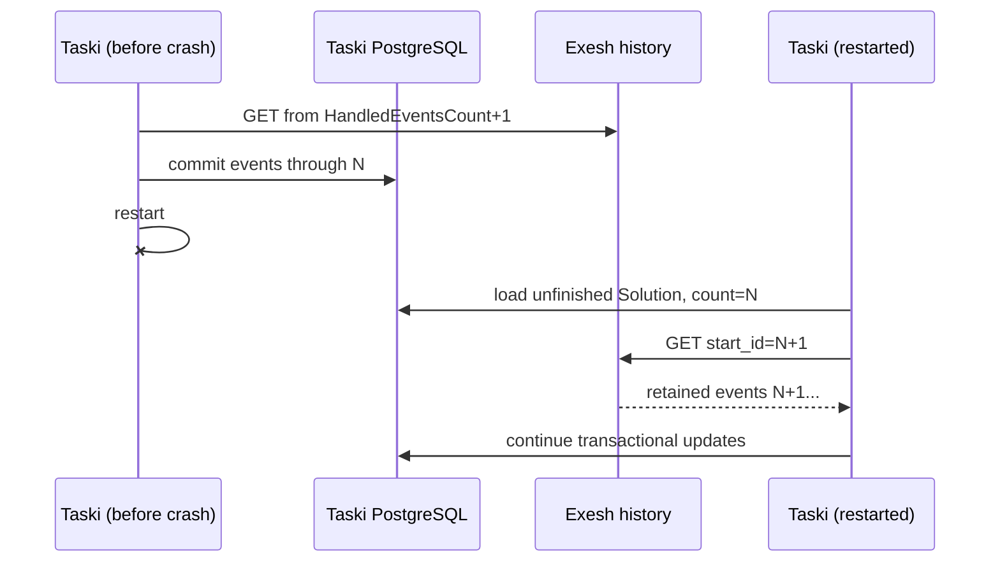

# REST event polling

## Purpose

Recover Exesh execution events from durable per-execution history without Kafka.
This is Taski's active production event-consumer mode.

## Participants

Taski REST consumer, Taski Solution storage, Exesh history HTTP API/PostgreSQL,
event update use case, and Taski PostgreSQL.

## Trigger

Periodic polling tick after Taski starts with `EVENT_CONSUMER_MODE=rest`,
including ticks after a restart.

## Preconditions

An unfinished Solution with Execution ID exists; Exesh endpoint/history is
reachable; strategy JSON is readable; history IDs are contiguous per execution.

## Current behavior

Production Ansible sets REST mode and disables Taski Kafka message dispatch.
Each tick loads all Solutions with `finished_at IS NULL`, then visits them
sequentially. For each, it starts at `HandledEventsCount + 1`, requests up to
configured count (default 100), sorts the page by Message ID, processes each
event transactionally with that ID, and paginates until an empty/short page.
One Solution failure is logged and the loop continues to the next.

The HTTP client has no configured timeout. The response carries `status`, but
the poller checks HTTP success and decodes events without validating that
application status. Dedupe tests `MessageID <= HandledEventsCount`, then
increments the count instead of assigning the observed ID. This is correct only
while IDs begin at one and contain no gaps. Exesh currently creates contiguous
per-execution history and does not delete it.

**Current guarantees.** Committed `HandledEventsCount` survives Taski restart,
and retained Exesh history can be replayed. A per-event transaction plus
inclusive cursor prevents duplicate processing under the current gap-free ID
contract. It is not a generic last-seen-ID guarantee.

## State transitions

`unfinished Solution at cursor N -> fetch history N+1 -> commit event -> cursor
N+1 -> ... -> finish sets FinishedAt`, after which it leaves the in-progress
scan. Missing finish leaves it forever in that scan.

## State ownership

| State | Owner | Storage | Survives restart | Source of truth |
| --- | --- | --- | --- | --- |
| History messages/IDs | Exesh | Exesh PostgreSQL | Yes | Exesh |
| Cursor/progress/verdict | Taski | Solution row | Yes | Taski |
| In-progress scan/page | poller | memory | No | recomputed from DB |
| Poll mode/interval/count | deployment/config | env/YAML | On redeploy | runtime config |

## Persistence and transaction boundaries

The in-progress list read and each update use Taski transactions; HTTP page
fetch is external. Each event commits independently, so restart resumes after
the last committed count. Exesh history persistence is independent. A page is
not atomically applied as a group.

## Idempotency and duplicate handling

Inclusive cursor and count comparison suppress already-counted contiguous IDs.
With an ID jump, the high event can be reprocessed on later ticks until the
count catches up. Duplicate IDs/order anomalies are not modeled. No retention
cursor is acknowledged back to Exesh.

## Ordering assumptions

The poller sorts a page but assumes globally monotonic, contiguous IDs starting
at one and stable pagination. It processes Solutions and events sequentially.
Duely's later Taski-message cursor is a separate count with separate ownership.

## Concurrency and race conditions

Multiple Taski instances can poll the same row; `FOR UPDATE` plus REST ID check
suppresses a duplicate only under contiguous semantics. A slow first Solution
delays all later ones. History arrival during pagination is observed on a later
page/tick depending on count.

## Failure handling

HTTP/decode/update errors are logged per Solution and retried next tick from the
last committed count. One hung HTTP call can stall the sequential poller. Bad
strategy/poison event repeatedly blocks that Solution but not others. Lost
Exesh history or missing finish has no reconciliation/timeout and leaves a
permanent in-progress row.

## Emitted messages

| Condition | Message type | Recipient/channel | Payload | Persistence | Retry |
| --- | --- | --- | --- | --- | --- |
| Replayed event changes Taski state | testing message | Taski history (production) | start/status/finish | Atomic with cursor | Fetch retries until commit |
| Poll failure | log | operators | execution/error | logs only | Next tick |

## Observability

Logs identify per-Solution fetch/update failures. There are no poll duration,
history lag, cursor, page count, HTTP latency, stuck-row, missing-finish, gap, or
multi-instance contention metrics.

## Implementation references

- `Taski/internal/consumer/rest_consumer.go`
- `Taski/internal/storage/postgres/solution_storage.go`
- `Taski/internal/usecase/testing/usecase/update/usecase.go`
- `Taski/internal/config/config.go`
- `Taski/ansible/deploy/playbook.yml`
- `Exesh/internal/api/execution/messages`
- [Exesh message history](../exesh/messages-history-and-outbox.md)

## Test coverage

- **Existing unit/integration tests:** none.
- **Covered scenarios:** none are automated.
- **Missing scenarios:** pagination, restart, multiple Solutions/instances,
  duplicate/gap/out-of-order IDs, status error, timeout, poison event, history
  loss, and missing finish.
- **Required contract tests:** inclusive `start_id`, count/page/status/event
  schema, contiguous Exesh IDs, cursor persistence, and production config.
- **Required failure-injection tests:** Taski restart after each event, HTTP
  failure/timeout/malformed page, DB rollback, concurrent pollers, ID gap,
  repeated page, Exesh restart/history retention, and permanent missing finish.

## Open questions

Whether gap-free IDs are a formal contract, desired multi-instance behavior,
history retention, timeout/reconciliation, and response-status handling are
unspecified.

## Proposed requirements

Persist last handled Message ID rather than infer it from a count; validate
monotonic gaps/status; bound HTTP calls and per-Solution work; make claiming
safe across instances; define retention/stuck reconciliation; expose lag; and
test restart/pagination/failure behavior.
