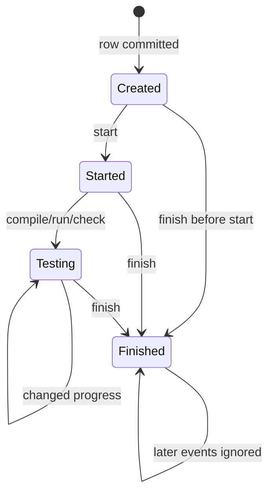

# Solution state and verdict

## Purpose

Explain Taski's persisted Solution lifecycle and the exact point at which
strategy job outcomes become intermediate status and final verdict.

## Participants

Testing submission/update use cases, Solution storage, concrete strategy,
Exesh event source, message dispatcher, PostgreSQL, and Duely consumer.

## Trigger

Solution creation after Exesh acceptance, each execution event, Taski restart,
metrics collection, or Duely status-history polling.

## Preconditions

A Solution row has a readable task type/strategy JSON and normally a unique
external ID and Exesh execution ID, though the schema does not enforce either.

## Current behavior

`Solutions` stores internal ID, nullable external/execution IDs, task ID,
submitted source text, language, strategy JSONB, creation/start/finish times,
last testing status, and `handled_events_count`. There is no lifecycle enum,
foreign key, unique ID index, cancellation, timeout, or strategy version.

Creation persists no start/finish/status. Start sets `StartedAt` once. Job events
mutate `JobSuccess`, task-specific status, verdict, and message. Equal
intermediate status is not re-emitted. Finish sets `FinishedAt` once and emits
strategy verdict; if none, `GetVerdict` returns `Testing Failed`. Exesh error is
sent as finish error. Events after finish do not change verdict/state, although
their count can advance.

WriteCode identifies jobs by regex/name. Suspect compile failure maps to
`Compilation Error`; suspect run/check failures map to the corresponding user
verdict/test, while checker/infrastructure failure maps to `Testing Failed`.
The earliest parsed failed test determines progress/final outcome; all expected
successes yield `Accepted`.

FindTest accepts when reference and submitted-counterexample behavior reaches
the `[suspect] check` expected `Wrong Answer`; a non-differing check yields
`Wrong Answer`; prep/reference execution failures yield `Testing Failed`.
PredictOutput expects checker `OK` for the supplied output; mismatch is `Wrong
Answer`; checker infrastructure failure is `Testing Failed`.

**Current guarantees.** A selected row is updated under `FOR UPDATE`; committed
strategy/verdict/timestamps survive restart; verdict is immutable to later job
events. There is no guarantee that events arrived completely/in order or that
the selected row was unique.

## State transitions

These labels are derived from `started_at`, `finished_at`, and event history.
There is no stored `Testing` state and no separate terminal-verdict column; the
verdict remains inside serialized strategy/public finish history.

## State ownership

| State | Owner | Storage | Survives restart | Source of truth |
| --- | --- | --- | --- | --- |
| Link/source/language/timestamps/cursor | Taski | `Solutions` columns | Yes | Taski PostgreSQL |
| Job outcomes/status/verdict/message | strategy | `testing_strategy` JSONB | Yes | serialized strategy |
| Execution/job truth | Exesh | Exesh DB/history | Yes per Exesh persistence | Exesh |
| Duely submission status/verdict | Duely | Duely PostgreSQL | Yes | Duely after consuming Taski messages |

## Persistence and transaction boundaries

Creation is one Taski transaction after external Exesh acceptance. Each event
uses another transaction that row-locks, deserializes, mutates, serializes, and
atomically saves the Solution and any public message. Metrics/read APIs use
separate snapshots. Exesh and Duely transactions are independent.

## Idempotency and duplicate handling

No unique index prevents duplicate external/execution IDs. Equal intermediate
status suppresses a repeat message, verdict prevents later job changes, but
Kafka duplicates can emit repeated starts and counts advance. REST dedupe is
count-based. Duely increments its own status count per consumed message.

## Ordering assumptions

Start should precede job events and finish should follow them. Regex parsing
assumes unchanged job names and ordered test IDs. Message histories assume
contiguous per-owner IDs. None of those event-order rules is validated by a
Solution state machine.

## Concurrency and race conditions

Row locks serialize one row, not duplicate rows for one execution. Finish can
win before earlier events and permanently force technical failure. Multiple
pollers/consumers can race; count checks only protect REST under gap-free IDs.

## Failure handling

Unreadable JSON or DB/message error rolls back an event and is retried by the
active consumer. Missing Solution is silently ignored. Missing finish leaves
the row forever in progress. Early finish terminalizes it. No manual retry,
recompute, migration, timeout, or reconciliation path exists.

## Emitted messages

| Condition | Message type | Recipient/channel | Payload | Persistence | Retry |
| --- | --- | --- | --- | --- | --- |
| Start handled | `start` | ExternalSolutionID | ID/type | Messages/outbox | Mode-dependent duplicates |
| Status changes | `status` | ExternalSolutionID | status string | same | Equal status suppressed |
| Finish | `finish` | ExternalSolutionID | verdict/error/message | same | First finish only at strategy level |

## Observability

Rows and public history reveal timestamps, cursor, serialized strategy, and
messages. Average completed duration is measured per task/language. No metric
reports state distribution, verdict distribution, oldest in-progress, cursor
lag, duplicate linkage, unreadable strategy, or finish-without-start.

## Implementation references

- `Taski/internal/domain/testing/solution.go`
- `Taski/internal/domain/testing/strategy/strategies/*.go`
- `Taski/internal/storage/postgres/solution_storage.go`
- `Taski/internal/usecase/testing/usecase/update/usecase.go`
- `Taski/internal/metrics/collector.go`
- `Duely/src/Duely.Application.UseCases/Features/Submissions/Update.cs`

## Test coverage

- **Existing unit/integration tests:** none in Taski.
- **Covered scenarios:** none are automated.
- **Missing scenarios:** state/timestamp transitions, full verdict matrix, first
  failed test, duplicate/out-of-order/unknown/post-finish events, row locking,
  restart/JSON compatibility, stuck row, and duplicate IDs.
- **Required contract tests:** every strategy/job status to exact public verdict
  and Duely mapping, plus stored JSON across versions.
- **Required failure-injection tests:** finish-first, missing finish/event,
  corrupt/old JSON, concurrent consumers, rollback after mutation, duplicate
  execution IDs, restart during progress, and long-lived rows.

## Open questions

Lifecycle invariants, terminal timeout, first-failure semantics, uniqueness,
verdict vocabulary, and strategy migration policy are unspecified.

## Proposed requirements

Define/enforce one state machine and one-to-one IDs; version/migrate strategies;
persist/query terminal outcome explicitly; define ordering/timeout/recompute;
and test every verdict, transition, restart, duplicate, and rollback path.

