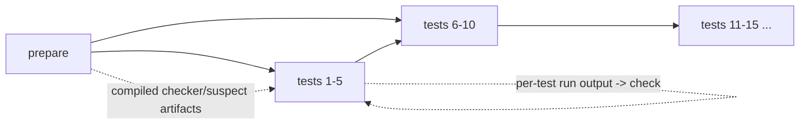

# Testing strategies

## Purpose

Translate `WriteCode`, `FindTest`, and `PredictOutput` tasks into Exesh graphs,
then use job events to derive intermediate testing status and a final verdict.

## Participants

Testing use case, strategy factory, concrete strategy, task bucket, Exesh, event
update use case, and PostgreSQL Solution storage.

## Trigger

New test submission constructs a strategy; every Exesh compile/run/check event
updates it; restart/polling deserializes it from the Solution row.

## Preconditions

Task type is `write_code`, `find_test`, or `predict_output`; language is `Cpp`,
`Python`, or `Golang`; referenced files/tests exist; job names/events match the
graph generated by that strategy version.

## Current behavior

The factory selects a concrete strategy from the task's discriminator. Common
state includes task type, stages, sources, per-job success flags, current
verdict, and message. WriteCode also persists test count/status. The entire
strategy is JSONB inside Solution and polymorphically reconstructed by
`task_type`; there is no schema version.

`WriteCode` adds bucket source `task`, inline `suspect solution`, `prepare`, and
test batch stages of five. C++/Go checker and suspect code are compiled when
needed; Python runs inline source. Each test runs suspect code, then checker
consumes task input/correct output and run artifact. Within a batch jobs can run
in parallel; every later batch depends on all earlier stage names, making
batches sequential. First parsed failing test drives status/verdict; suspect
compile/run/check failure maps to user verdict, while infrastructure-named
failures map to `Testing Failed`.

`FindTest` treats submitted text as test input. `prepare` may compile checker,
reference source, and solution; `check` runs source and solution and compares
their outputs. The suspect check's success status is intentionally `Wrong
Answer`: finding a differing output yields `Accepted`; matching/non-differing
output yields `Wrong Answer`. Infrastructure preparation/run failure yields
`Testing Failed`.

`PredictOutput` treats submitted text as the suspect output. It prepares the
checker and performs one `[suspect] check` against bucket input/correct output;
checker `OK` yields `Accepted`, mismatch yields `Wrong Answer`, and
infrastructure failure yields `Testing Failed`.

**Current guarantees.** Graph names are deterministic for one task/strategy
version. Once a strategy verdict is set, later job events do not change it.
These names/regexes are persisted behavior, not validated schema contracts.

## State transitions

Conceptually: `strategy created -> jobs unknown -> job successes/failures ->
intermediate status -> verdict`. Concrete Solution lifecycle is documented in
[solution state and verdict](solution-state-and-verdict.md).

## State ownership

| State | Owner | Storage | Survives restart | Source of truth |
| --- | --- | --- | --- | --- |
| Graph definition | strategy/Exesh | Solution JSONB + Exesh DB | Yes | copies with different responsibilities |
| Job execution | Exesh | Exesh state/history | Yes as persisted by Exesh | Exesh |
| JobSuccess/status/verdict | Taski strategy | Solution JSONB | Yes | Taski |
| Regex/name interpretation | Taski code | binary | Changes on deploy | running version |

## Persistence and transaction boundaries

Initial strategy JSON is inserted with Solution after Exesh acceptance.
Subsequent strategy mutation, public message history/outbox, cursor increment,
and Solution update share one Taski DB transaction per event. Exesh job state is
outside it. Runtime HTTP/client objects are not serialized.

## Idempotency and duplicate handling

Per-job boolean state makes repeated identical job success/failure mostly
convergent, but event processing can still increment the cursor and emit
duplicate start/finish-related effects. Unknown job names are ignored. No event
ID is stored in Kafka mode. A set verdict suppresses later job mutation.

## Ordering assumptions

Regexes assume exact deterministic job names. WriteCode assumes test IDs are a
permutation `1..N`. Events are expected to reflect dependency order and finish
last; Taski itself does not reorder them. Batch dependencies encode sequential
batches, not first-failure cancellation.

## Concurrency and race conditions

Solution row selection uses `FOR UPDATE`, serializing updates to the selected
row. Duplicate execution IDs can defeat clear ownership. Different partitions
or REST workers may present events out of order before acquiring that lock.

## Failure handling

Strategy construction errors prevent local Solution creation, though Exesh is
called only after construction. Deserialization incompatibility makes an
existing row unreadable and can block polling/metrics. Infrastructure-named job
failure becomes `Testing Failed`; suspect-named failure becomes a user verdict
according to concrete rules. Unknown jobs do not fail processing.

## Emitted messages

| Condition | Message type | Recipient/channel | Payload | Persistence | Retry |
| --- | --- | --- | --- | --- | --- |
| Intermediate result changes | `status` | external solution / history or Kafka | strategy status | Taski Messages (+ optional Outbox) | Transaction/event retry |
| Finish | `finish` | external solution / history or Kafka | verdict, optional error/message | same | same |

## Observability

Serialized strategy and message history allow post-hoc inspection; logs expose
errors. Metrics show average completed duration per task/language, not per-job
progress, first failure, graph version, stuck batch, or deserialization errors
as dedicated series.

## Implementation references

- `Taski/internal/factory/testing_strategy_factory.go`
- `Taski/internal/domain/testing/strategy/strategies/*.go`
- `Taski/internal/domain/testing/{execution,source,input,job}`
- `Taski/internal/storage/postgres/solution_storage.go`
- `Taski/internal/usecase/testing/usecase/update/usecase.go`

## Test coverage

- **Existing unit/integration tests:** none.
- **Covered scenarios:** none are automated.
- **Missing scenarios:** all graph variants/languages, batch boundaries, first
  failure, unexpected/out-of-order/duplicate events, verdict immutability,
  restart deserialization, and old JSON/job names.
- **Required contract tests:** exact stages/dependencies/job/source/input names,
  types, statuses, limits, graph acceptance by Exesh, and full verdict tables.
- **Required failure-injection tests:** corrupt/old strategy JSON, unknown job,
  finish early, missing event, concurrent events, DB rollback after mutation,
  and rolling-version processing.

## Open questions

The intended first-failure/cancellation policy, status wording, name/schema
compatibility, and treatment of unknown/out-of-order events are unresolved.

## Proposed requirements

Version serialized strategies and graph naming; validate task tests and graph
references before dispatch; formalize per-task verdict tables and event-order
policy; preserve compatibility through migrations; and add exhaustive graph,
verdict, restart, duplicate, and failure tests.

