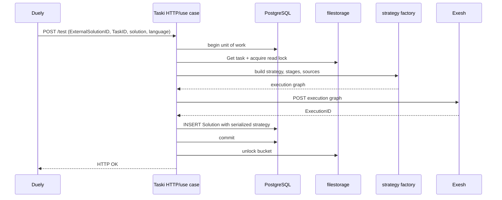

# Testing submission

## Purpose

Accept a caller's solution, build a task-specific Exesh execution, and durably
link the caller's `ExternalSolutionID` to the returned Exesh `ExecutionID`.

## Participants

Duely/caller, Taski test HTTP API, testing use case, PostgreSQL unit of work,
task storage/filestorage, strategy factory, Exesh HTTP API, and Solution
storage.

## Trigger

HTTP `POST /test` with task ID, external solution ID, source/input/output text,
and language.

## Preconditions

The task bucket exists and is readable, request fields decode to supported task
and language identifiers, strategy construction succeeds, and Exesh is
reachable and accepts the graph.

## Current behavior

The handler passes `ExternalSolutionID`, `TaskID`, solution text, and language
to the test use case. One PostgreSQL unit-of-work transaction begins before the
task is loaded. Task storage takes a bucket read lock. While both the DB
transaction and bucket lock remain held, the factory creates the concrete
strategy, stages, jobs, sources, and inputs, then the Exesh client posts the
graph. Its default `http.Client` has no configured timeout beyond the inbound
request context. On HTTP 200 it decodes `ExecutionID`.

Only then does Taski create a Solution with the external ID, task ID, Exesh ID,
full submitted text, language, serialized strategy, and creation time. The row
is inserted and the unit of work commits; unlock runs after the callback. The
HTTP response is only success/failure and does not return Taski/Exesh IDs.

**Current guarantees.** Taski never commits the Solution when strategy
construction or a reported Exesh call fails. It cannot atomically commit Exesh
and PostgreSQL, cannot cancel an accepted Exesh execution, and has no
reconciliation record for an execution accepted before local failure.

## State transitions

`No Solution -> Exesh execution accepted -> Taski Solution committed`.
Failures may produce `No Taski Solution + live orphan Exesh execution`; repeated
requests produce additional rows/executions.

## State ownership

| State | Owner | Storage | Survives restart | Source of truth |
| --- | --- | --- | --- | --- |
| Submitted text/external ID | Taski after commit | `Solutions` | Yes | Taski PostgreSQL |
| Task/package | Taski/filestorage | bucket | Yes | committed bucket |
| Graph/strategy | Taski and Exesh copies | JSONB / Exesh DB | Yes | each service for its behavior |
| Execution lifecycle | Exesh | Exesh PostgreSQL/runtime | Yes for persisted portions | Exesh |
| Bucket read lock | filestorage | lock state | Only while request lives | filestorage |

## Persistence and transaction boundaries

Task read, strategy creation, external Exesh HTTP, and Solution insert occur
inside the Taski UoW callback; only PostgreSQL work is atomic. The bucket is
locked across the external call. Exesh acceptance is outside the transaction
and remains after Taski rollback, commit failure, connection loss, or process
death. There is no distributed transaction or compensation.

| Crash point | Taski state | Exesh state | Automatic recovery | Duplicate/orphan risk |
| --- | --- | --- | --- | --- |
| Before Exesh request | No committed row | None | Client may retry | No orphan; retry starts new attempt |
| Exesh accepts, response lost | No committed row | Execution exists | None | Orphan; retry duplicates execution |
| Response decoded, before insert | No committed row | Execution exists | None | Orphan |
| Insert issued, transaction rolls back | No committed row | Execution exists | None | Orphan |
| Commit succeeds, HTTP response lost | Solution exists | Execution exists | Poller can continue it | Client retry creates duplicate pair |
| After HTTP OK | Solution exists | Execution exists | Normal event processing | Normal duplicate risks remain |

## Idempotency and duplicate handling

There is no request idempotency key, lookup-before-create, or unique index on
`external_id`/`execution_id`. Both can appear in multiple rows. A repeated
request repeats task load, graph creation, Exesh call, and insert. Multiple rows
for one execution make `GetByExecutionID FOR UPDATE` selection ambiguous;
multiple rows for one external ID can break message ID generation.

## Ordering assumptions

Taski assumes the Solution can be committed before events need it. This is not
guaranteed in Kafka mode because Exesh can emit immediately. It assumes task
files remain available while Exesh downloads them; holding the read lock during
submission does not cover later worker downloads.

## Concurrency and race conditions

Concurrent identical submissions are not serialized by a uniqueness
constraint. Long/blocked Exesh HTTP holds a DB transaction and bucket lock.
Events can race the local commit; callers can race after an ambiguous response.

## Failure handling

Task/storage/factory/HTTP/decode/insert/commit errors roll back PostgreSQL and
return an HTTP error. Exesh work that already exists is neither canceled nor
recorded. No HTTP timeout, Solution size limit, cancellation endpoint, orphan
scanner, or retry policy exists. A hung Exesh call can hold resources until the
caller context is canceled.

## Emitted messages

| Condition | Message type | Recipient/channel | Payload | Persistence | Retry |
| --- | --- | --- | --- | --- | --- |
| Submission accepted locally | HTTP response | Duely/caller | generic OK | Solution row | Caller controlled |
| Submission fails | HTTP error | Duely/caller | error envelope | local tx rolled back | Caller controlled |
| Execution begins later | Taski `start` | Duely via history/Kafka | external solution ID | Created by event path | See message docs |

## Observability

Errors are logged and Solution rows expose linked IDs/strategy. There is no
correlation response, cross-service trace, request-duration/orphan/duplicate
metric, transaction/lock duration metric, or list of Exesh executions lacking a
Taski row.

## Implementation references

- `Taski/internal/api/testing/test/{api,handler}.go`
- `Taski/internal/usecase/testing/usecase/test/usecase.go`
- `Taski/internal/factory/testing_strategy_factory.go`
- `Taski/internal/api/testing/execute/client.go`
- `Taski/internal/storage/postgres/{unit_of_work,solution_storage}.go`
- `Taski/internal/storage/filestorage/task_storage.go`

## Test coverage

- **Existing unit/integration tests:** none in Taski.
- **Covered scenarios:** none are automated.
- **Missing scenarios:** each task type/language, duplicate IDs, request size,
  lock/transaction lifetime, response loss, rollback, timeout, and orphan.
- **Required contract tests:** exact Taski request, generated Exesh request and
  response, Solution fields, IDs, language/type strings, and bucket availability.
- **Required failure-injection tests:** Exesh accepts then disconnects, slow
  Exesh, DB insert/commit failure after acceptance, process death at every crash
  point, client retry, concurrent same ID, and event-before-commit.

## Open questions

The required one-to-one cardinality, retry semantics, timeout/size limits,
cancellation, and orphan reconciliation owner are unspecified.

## Proposed requirements

Define an idempotent submission key and unique cardinality; avoid holding local
transactions across external calls; persist an intent before dispatch; provide
bounded HTTP/cancellation and a reconciliation/compensation process; return a
correlation ID; and test every crash point.

